# CLAUDE.md

This file provides guidance to Claude Code (claude.ai/code) when working with code in this repository.

## Table of Contents
- [Development Commands](#development-commands)
- [System Architecture](#system-architecture)
- [Requirements Documentation](#requirements-documentation)
- [Use Cases](#use-cases)
- [Design Documents](#design-documents)
- [Test Cases & Acceptance Criteria](#test-cases--acceptance-criteria)
- [UML Diagrams](#uml-diagrams)
- [Development Guide](#development-guide)

---

## Development Commands

### Core Development
- `npm run dev` - Start development server (Vite on port 5173)
- `npm run build` - Build for production (optimized for Cloudflare Pages)
- `npm run preview` - Preview production build locally

### Code Quality & Validation
- `npm run lint` - Run ESLint and Prettier checks (fails on violations)
- `npm run format` - Format code with Prettier (auto-fixes formatting)
- `npm run check` - Run Svelte type checking (TypeScript validation)
- `npm run check:watch` - Run Svelte type checking in watch mode

### Testing
- `npm run test` - Run all tests (unit + e2e in sequence)
- `npm run test:unit` - Run unit tests with Vitest (watch mode available)
- `npm run test:e2e` - Run Playwright end-to-end tests (headless browser)

### Database Management
- `npm run db:push` - Push schema changes to local SQLite database
- `npm run db:generate` - Generate migration files from schema changes
- `npm run db:studio` - Open Drizzle Studio for database inspection
- `npm run db:migrate` - Run migrations (used in CI/CD)
- `npm run db:d1:dev` - Apply migrations to D1 development database (local)
- `npm run db:d1:prod` - Apply migrations to D1 production database (remote)

### Deployment & Infrastructure
- `npm run wrangler:dev` - Run Wrangler dev server for Cloudflare Pages
- `npm run mcp:test` - Test GitHub MCP integration
- `npm run issues:create` - Create GitHub issues from TODO list

---

## System Architecture

### Tech Stack Overview

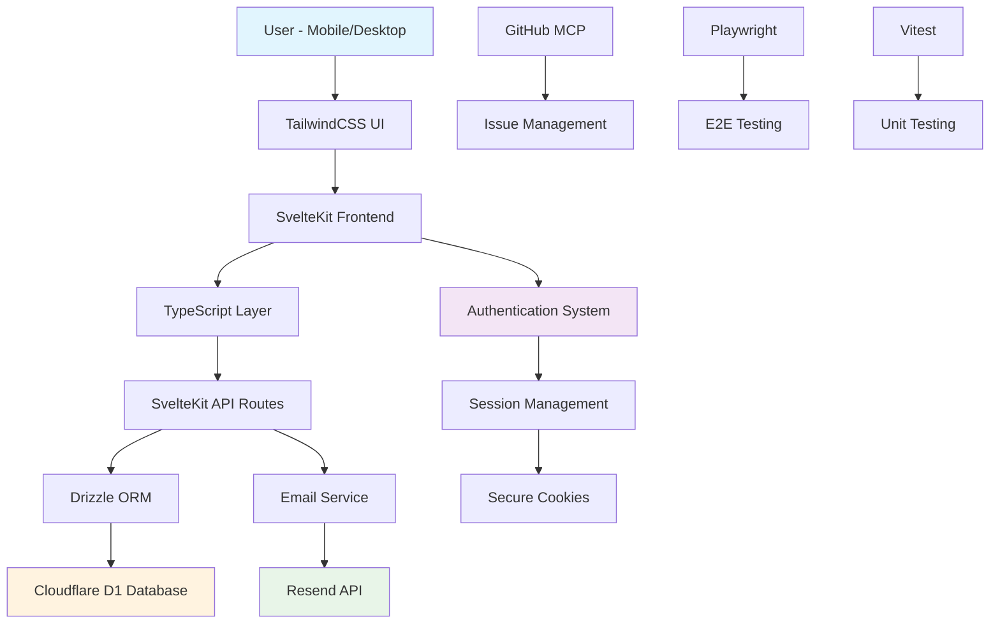

### Database Schema (Current + Planned)

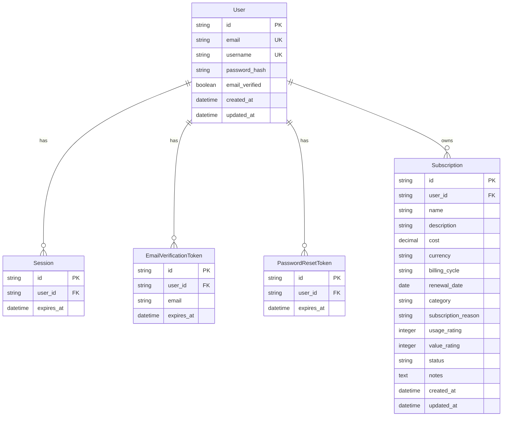

### Authentication Flow

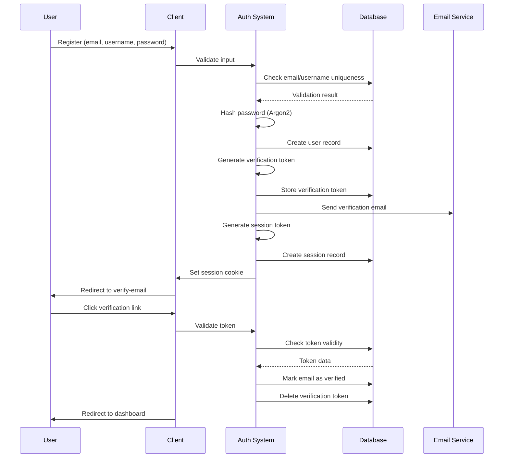

### User Journey Flow

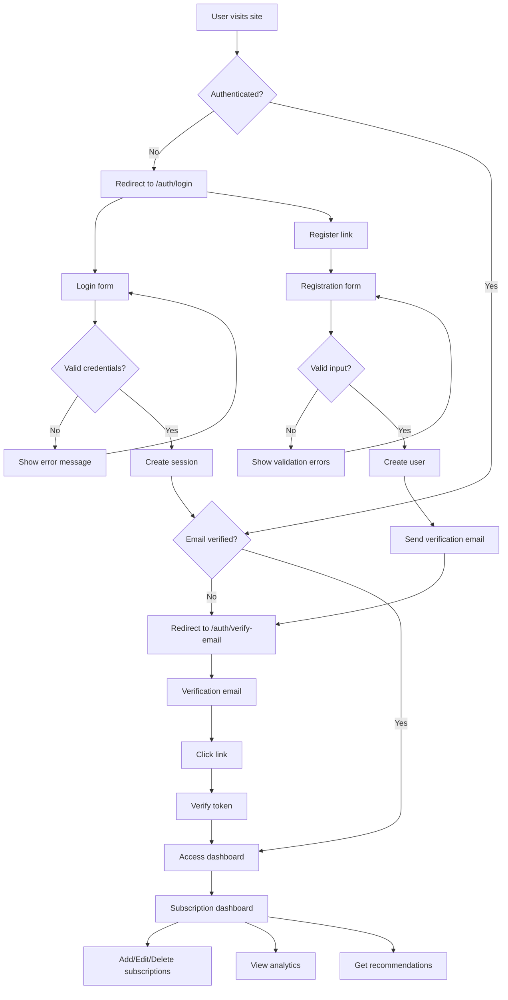

---

## Requirements Documentation

### Functional Requirements

#### FR-001: User Authentication
- **Description**: Secure user registration and login system
- **Priority**: Critical
- **Acceptance Criteria**:
  - Users can register with email, username, and password
  - Email verification required before accessing protected features
  - Secure password hashing using Argon2
  - Session-based authentication with 30-day expiry
  - Password reset functionality via email
  - Proper input validation and error handling

#### FR-002: Subscription Management
- **Description**: Complete CRUD operations for subscription tracking
- **Priority**: Critical
- **Acceptance Criteria**:
  - Users can add subscriptions with name, cost, billing cycle, category
  - Multi-currency support with ISO 4217 currency codes
  - Usage and value rating system (1-5 scale)
  - Subscription categorization (Entertainment, Productivity, etc.)
  - Edit and delete existing subscriptions
  - Subscription status tracking (active, cancelled, paused)

#### FR-003: Analytics and Insights
- **Description**: Cost analysis and spending insights
- **Priority**: High
- **Acceptance Criteria**:
  - Monthly and yearly spending calculations
  - Multi-currency cost conversion and display
  - Spending trends and patterns analysis
  - Category-based spending breakdown
  - Export functionality for personal records

#### FR-004: Recommendations System
- **Description**: Rule-based subscription recommendations
- **Priority**: Medium
- **Acceptance Criteria**:
  - Identify low-usage, low-value subscriptions
  - Suggest cancellation based on usage/value ratings
  - Recommend alternative plans or services
  - Prioritize recommendations by potential savings

### Non-Functional Requirements

#### NFR-001: Performance
- **Description**: Application response time and scalability
- **Requirements**:
  - Page load time < 2 seconds on 3G connection
  - Database queries < 500ms response time
  - Support for 10,000+ concurrent users
  - Mobile-first optimized for touch devices

#### NFR-002: Security
- **Description**: Data protection and user privacy
- **Requirements**:
  - HTTPS/TLS encryption for all communications
  - Secure session management with httpOnly cookies
  - Input validation and sanitization
  - SQL injection prevention
  - XSS protection
  - Rate limiting on authentication endpoints

#### NFR-003: Usability
- **Description**: User experience and accessibility
- **Requirements**:
  - Mobile-first responsive design
  - Accessibility compliance (WCAG 2.1 AA)
  - Intuitive navigation and user flows
  - Error messages in user-friendly language
  - Support for multiple currencies and locales

#### NFR-004: Reliability
- **Description**: System availability and error handling
- **Requirements**:
  - 99.9% uptime availability
  - Graceful error handling and recovery
  - Data backup and recovery procedures
  - Monitoring and alerting systems

### Business Requirements

#### BR-001: User Retention
- **Description**: Encourage continued platform usage
- **Requirements**:
  - Gamification elements (achievement system)
  - Regular insights and notifications
  - Social features for sharing savings
  - Personalized recommendations

#### BR-002: Cost Optimization
- **Description**: Help users reduce subscription costs
- **Requirements**:
  - Savings tracking and goal setting
  - Duplicate subscription detection
  - Price change notifications
  - Negotiation assistance features

#### BR-003: Market Expansion
- **Description**: Support global user base
- **Requirements**:
  - Multi-currency support
  - Internationalization (i18n) ready
  - Regional subscription database
  - Local payment method integration

### Technical Requirements

#### TR-001: Frontend Architecture
- **Framework**: SvelteKit 2.x with TypeScript
- **Styling**: TailwindCSS 4.x with mobile-first approach
- **State Management**: Svelte stores for client-side state
- **Routing**: SvelteKit file-based routing
- **Build Tool**: Vite for development and production builds

#### TR-002: Backend Architecture
- **Runtime**: Node.js with SvelteKit API routes
- **Database**: Cloudflare D1 (SQLite) with Drizzle ORM
- **Authentication**: Custom session-based auth
- **Email Service**: Resend API for transactional emails
- **Deployment**: Cloudflare Pages with Edge Runtime

#### TR-003: Development Tools
- **Version Control**: Git with GitHub
- **Code Quality**: ESLint, Prettier, TypeScript strict mode
- **Testing**: Vitest (unit), Playwright (e2e)
- **CI/CD**: GitHub Actions for automated testing and deployment
- **Monitoring**: OpenTelemetry for observability

---

## Use Cases

### Primary Use Cases

#### UC-001: User Registration
**Actor**: New User  
**Preconditions**: User has valid email address  
**Main Flow**:
1. User navigates to registration page
2. User enters email, username, and password
3. System validates input data
4. System creates user account with unverified email
5. System sends verification email
6. User clicks verification link
7. System marks email as verified
8. User gains access to dashboard

**Alternative Flows**:
- A1: Invalid email format → Show validation error
- A2: Username already taken → Show error message
- A3: Password too weak → Show password requirements
- A4: Email already exists → Redirect to login

**Postconditions**: User account created and verified

#### UC-002: Subscription Management
**Actor**: Authenticated User  
**Preconditions**: User is logged in and email verified  
**Main Flow**:
1. User navigates to dashboard
2. User clicks "Add Subscription"
3. User fills subscription form (name, cost, billing cycle, etc.)
4. User rates usage and value (1-5 scale)
5. System validates and saves subscription
6. System updates spending calculations
7. Dashboard displays updated subscription list

**Alternative Flows**:
- A1: Invalid cost amount → Show validation error
- A2: Missing required fields → Highlight required fields
- A3: Duplicate subscription → Warn user about potential duplicate

**Postconditions**: Subscription added to user's account

#### UC-003: Analytics and Recommendations
**Actor**: Authenticated User  
**Preconditions**: User has subscriptions in their account  
**Main Flow**:
1. User navigates to insights page
2. System calculates spending analytics
3. System applies recommendation algorithm
4. System displays spending breakdown and recommendations
5. User can act on recommendations (cancel, keep, review)

**Alternative Flows**:
- A1: No subscriptions → Show empty state with call-to-action
- A2: All subscriptions high-value → Show positive reinforcement

**Postconditions**: User receives personalized insights

### Secondary Use Cases

#### UC-004: Password Reset
**Actor**: User (authenticated or not)  
**Preconditions**: User has forgotten password  
**Main Flow**:
1. User clicks "Forgot Password" link
2. User enters email address
3. System validates email exists
4. System generates reset token
5. System sends reset email
6. User clicks reset link
7. User enters new password
8. System updates password hash
9. System invalidates all existing sessions

**Alternative Flows**:
- A1: Email not found → Show generic success message (security)
- A2: Token expired → Show error, offer to resend
- A3: Invalid new password → Show validation errors

**Postconditions**: User password updated successfully

#### UC-005: Session Management
**Actor**: Authenticated User  
**Preconditions**: User is logged in  
**Main Flow**:
1. User performs actions within session
2. System checks session validity on each request
3. System renews session if near expiry
4. User can logout to end session
5. System clears session cookie

**Alternative Flows**:
- A1: Session expired → Redirect to login
- A2: Invalid session → Clear cookie, redirect to login

**Postconditions**: Session properly managed

### Edge Cases and Error Scenarios

#### EC-001: Network Connectivity Issues
**Scenario**: User loses internet connection during form submission  
**Handling**: 
- Show offline indicator
- Queue form data locally
- Retry submission when connection restored
- Show user-friendly error messages

#### EC-002: Concurrent Session Conflicts
**Scenario**: User logs in from multiple devices  
**Handling**: 
- Allow multiple sessions (current behavior)
- Optional: Notify user of multiple sessions
- Future: Session management preferences

#### EC-003: Database Connectivity Issues
**Scenario**: Database becomes unavailable  
**Handling**: 
- Show maintenance message
- Implement retry logic with exponential backoff
- Graceful degradation for read-only operations

#### EC-004: Email Service Failures
**Scenario**: Email service (Resend) is unavailable  
**Handling**: 
- Continue with registration but mark email as unverified
- Implement email retry queue
- Provide manual verification option
- Log failures for monitoring

---

## Design Documents

### System Architecture Design

#### Multi-Tier Architecture
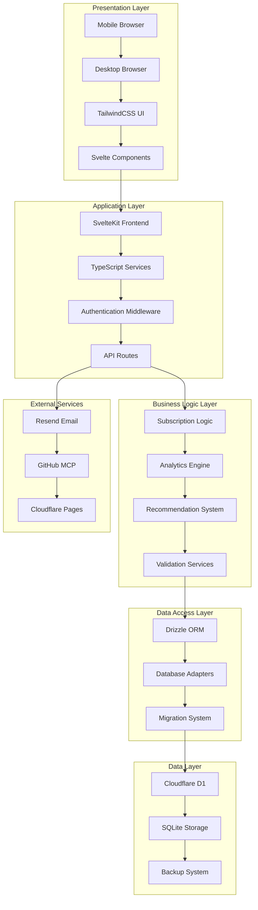

#### Security Architecture
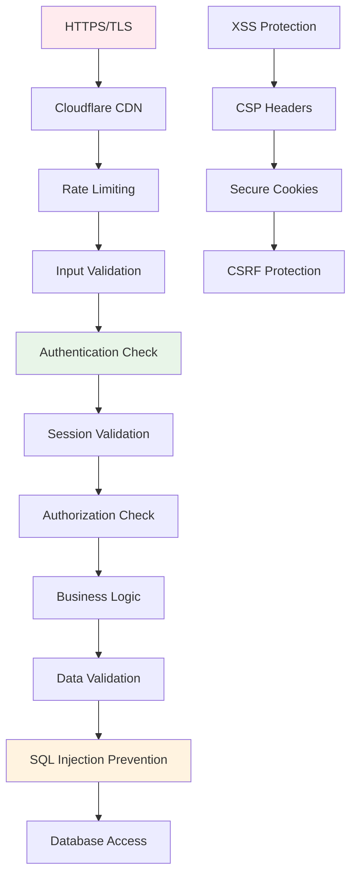

### Database Design

#### Current Schema (Authentication Phase)
```sql
-- Users table with enhanced security
CREATE TABLE user (
    id TEXT PRIMARY KEY,
    email TEXT NOT NULL UNIQUE,
    username TEXT NOT NULL UNIQUE,
    password_hash TEXT NOT NULL,
    email_verified BOOLEAN NOT NULL DEFAULT false,
    created_at DATETIME NOT NULL DEFAULT CURRENT_TIMESTAMP,
    updated_at DATETIME NOT NULL DEFAULT CURRENT_TIMESTAMP
);

-- Session management
CREATE TABLE session (
    id TEXT PRIMARY KEY,
    user_id TEXT NOT NULL REFERENCES user(id),
    expires_at DATETIME NOT NULL
);

-- Email verification tokens
CREATE TABLE email_verification_token (
    id TEXT PRIMARY KEY,
    user_id TEXT NOT NULL REFERENCES user(id),
    email TEXT NOT NULL,
    expires_at DATETIME NOT NULL
);

-- Password reset tokens
CREATE TABLE password_reset_token (
    id TEXT PRIMARY KEY,
    user_id TEXT NOT NULL REFERENCES user(id),
    expires_at DATETIME NOT NULL
);
```

#### Planned Schema (Subscription Management)
```sql
-- Subscription tracking
CREATE TABLE subscription (
    id TEXT PRIMARY KEY,
    user_id TEXT NOT NULL REFERENCES user(id),
    name TEXT NOT NULL,
    description TEXT,
    cost DECIMAL(10,2) NOT NULL,
    currency TEXT NOT NULL DEFAULT 'USD',
    billing_cycle TEXT NOT NULL CHECK (billing_cycle IN ('one-time', 'weekly', 'monthly', 'quarterly', 'yearly')),
    renewal_date DATE,
    category TEXT NOT NULL,
    subscription_reason TEXT NOT NULL,
    usage_rating INTEGER CHECK (usage_rating >= 1 AND usage_rating <= 5),
    value_rating INTEGER CHECK (value_rating >= 1 AND value_rating <= 5),
    status TEXT NOT NULL DEFAULT 'active' CHECK (status IN ('active', 'cancelled', 'paused')),
    notes TEXT,
    created_at DATETIME NOT NULL DEFAULT CURRENT_TIMESTAMP,
    updated_at DATETIME NOT NULL DEFAULT CURRENT_TIMESTAMP
);

-- Category management
CREATE TABLE category (
    id TEXT PRIMARY KEY,
    name TEXT NOT NULL UNIQUE,
    description TEXT,
    icon TEXT,
    color TEXT,
    created_at DATETIME NOT NULL DEFAULT CURRENT_TIMESTAMP
);

-- User preferences
CREATE TABLE user_preference (
    id TEXT PRIMARY KEY,
    user_id TEXT NOT NULL REFERENCES user(id),
    default_currency TEXT NOT NULL DEFAULT 'USD',
    timezone TEXT NOT NULL DEFAULT 'UTC',
    notification_email BOOLEAN NOT NULL DEFAULT true,
    notification_push BOOLEAN NOT NULL DEFAULT false,
    created_at DATETIME NOT NULL DEFAULT CURRENT_TIMESTAMP,
    updated_at DATETIME NOT NULL DEFAULT CURRENT_TIMESTAMP
);
```

### API Design Specifications

#### Authentication Endpoints
```typescript
// POST /auth/register
interface RegisterRequest {
    email: string;
    username: string;
    password: string;
    confirmPassword: string;
}

interface RegisterResponse {
    success: boolean;
    user?: {
        id: string;
        email: string;
        username: string;
        emailVerified: boolean;
    };
    error?: string;
}

// POST /auth/login
interface LoginRequest {
    email: string;
    password: string;
}

interface LoginResponse {
    success: boolean;
    user?: {
        id: string;
        email: string;
        username: string;
        emailVerified: boolean;
    };
    error?: string;
}

// POST /auth/verify-email
interface VerifyEmailRequest {
    token: string;
}

interface VerifyEmailResponse {
    success: boolean;
    error?: string;
}
```

#### Subscription Management Endpoints
```typescript
// POST /api/subscriptions
interface CreateSubscriptionRequest {
    name: string;
    description?: string;
    cost: number;
    currency: string;
    billingCycle: 'one-time' | 'weekly' | 'monthly' | 'quarterly' | 'yearly';
    renewalDate?: string;
    category: string;
    subscriptionReason: string;
    usageRating: 1 | 2 | 3 | 4 | 5;
    valueRating: 1 | 2 | 3 | 4 | 5;
    notes?: string;
}

interface SubscriptionResponse {
    id: string;
    userId: string;
    name: string;
    description?: string;
    cost: number;
    currency: string;
    billingCycle: string;
    renewalDate?: string;
    category: string;
    subscriptionReason: string;
    usageRating: number;
    valueRating: number;
    status: 'active' | 'cancelled' | 'paused';
    notes?: string;
    createdAt: string;
    updatedAt: string;
}

// GET /api/subscriptions
interface GetSubscriptionsResponse {
    subscriptions: SubscriptionResponse[];
    totalCount: number;
    totalMonthlyCost: number;
    totalYearlyCost: number;
}

// GET /api/analytics
interface AnalyticsResponse {
    monthlySpending: number;
    yearlySpending: number;
    subscriptionCount: number;
    categoryBreakdown: {
        category: string;
        count: number;
        totalCost: number;
    }[];
    recommendations: {
        type: 'cancel' | 'review' | 'keep';
        subscriptionId: string;
        reason: string;
        potentialSavings?: number;
    }[];
}
```

### UI/UX Design Principles

#### Mobile-First Design Philosophy
1. **Progressive Enhancement**: Start with mobile constraints, enhance for desktop
2. **Touch-Friendly Interactions**: Minimum 44px tap targets, gesture support
3. **Responsive Breakpoints**: 
   - Mobile: 320px - 768px
   - Tablet: 768px - 1024px  
   - Desktop: 1024px+
4. **Performance Optimization**: Lazy loading, optimized images, minimal JavaScript

#### Component Design System
```typescript
// Design tokens
interface DesignTokens {
    colors: {
        primary: '#3b82f6';
        secondary: '#64748b';
        success: '#10b981';
        warning: '#f59e0b';
        error: '#ef4444';
        background: '#ffffff';
        surface: '#f8fafc';
        text: '#1e293b';
    };
    spacing: {
        xs: '0.25rem';
        sm: '0.5rem';
        md: '1rem';
        lg: '1.5rem';
        xl: '2rem';
        '2xl': '3rem';
    };
    typography: {
        fontFamily: 'Inter, sans-serif';
        fontSize: {
            xs: '0.75rem';
            sm: '0.875rem';
            base: '1rem';
            lg: '1.125rem';
            xl: '1.25rem';
            '2xl': '1.5rem';
        };
    };
}
```

#### Accessibility Guidelines
1. **Semantic HTML**: Proper heading hierarchy, form labels, ARIA attributes
2. **Keyboard Navigation**: Full keyboard accessibility, focus management
3. **Screen Reader Support**: Alt text, aria-labels, proper markup
4. **Color Contrast**: WCAG 2.1 AA compliance (4.5:1 ratio minimum)
5. **Responsive Text**: Scalable fonts, readable at 200% zoom

### Security Design

#### Authentication Security
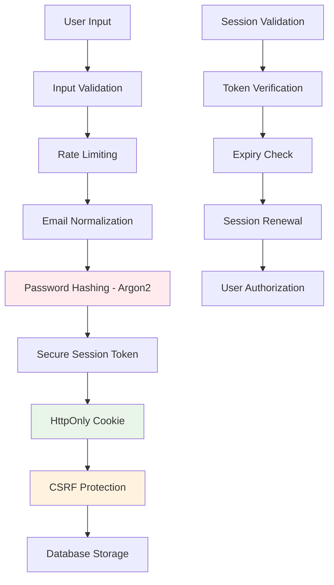

#### Data Protection Measures
1. **Encryption**: 
   - TLS 1.3 for data in transit
   - Database encryption at rest
   - Secure key management
2. **Input Validation**: 
   - Client-side validation for UX
   - Server-side validation for security
   - SQL injection prevention
3. **Session Management**: 
   - Secure session tokens
   - HttpOnly and SameSite cookies
   - Automatic session renewal
4. **Error Handling**: 
   - No sensitive data in error messages
   - Proper logging without exposing secrets
   - Graceful degradation

---

## Test Cases & Acceptance Criteria

### Authentication Test Cases

#### TC-001: User Registration
**Test Scenario**: Valid user registration flow  
**Preconditions**: User has valid email and meets password requirements  
**Test Steps**:
1. Navigate to `/auth/register`
2. Enter valid email: `test@example.com`
3. Enter valid username: `testuser`
4. Enter strong password: `TestPass123`
5. Confirm password: `TestPass123`
6. Click "Register" button
7. Verify redirect to `/auth/verify-email`
8. Check verification email sent

**Expected Results**:
- User account created in database
- Email verification token generated
- Verification email sent successfully
- User redirected to email verification page
- Session cookie set with proper security flags

**Acceptance Criteria**:
- [ ] User record created with `email_verified = false`
- [ ] Password properly hashed using Argon2
- [ ] Email verification token stored with 2-hour expiry
- [ ] Session created with 30-day expiry
- [ ] Verification email sent via Resend API
- [ ] User redirected to verify-email page
- [ ] Form validation prevents duplicate submissions

#### TC-002: Input Validation
**Test Scenario**: Registration with invalid inputs  
**Test Data**:
- Invalid email: `not-an-email`
- Weak password: `123`
- Mismatched passwords: `Pass123` vs `Pass456`
- Long username: `verylongusernamethatexceedslimit`

**Test Steps**:
1. Navigate to registration page
2. Enter invalid email format
3. Attempt to submit form
4. Verify client-side validation error
5. Enter weak password
6. Verify password requirements shown
7. Enter mismatched passwords
8. Verify password match error

**Expected Results**:
- Client-side validation prevents form submission
- User-friendly error messages displayed
- Form fields highlighted with error states
- No API calls made with invalid data

**Acceptance Criteria**:
- [ ] Email validation regex prevents invalid formats
- [ ] Password strength requirements enforced
- [ ] Password confirmation matching validated
- [ ] Username length and character restrictions enforced
- [ ] Error messages are user-friendly and actionable

#### TC-003: Login Flow
**Test Scenario**: Successful login with verified account  
**Preconditions**: User has verified account  
**Test Steps**:
1. Navigate to `/auth/login`
2. Enter valid email and password
3. Click "Login" button
4. Verify redirect based on email verification status
5. Check session cookie creation
6. Verify access to protected routes

**Expected Results**:
- User authenticated successfully
- Session cookie set with proper security flags
- Redirect to dashboard (if verified) or verify-email page
- Protected routes accessible with valid session

**Acceptance Criteria**:
- [ ] Password verification using Argon2
- [ ] Session token generated and stored
- [ ] HttpOnly, SameSite cookie security flags
- [ ] Proper redirect based on email verification status
- [ ] Session validation middleware protects routes

#### TC-004: Email Verification
**Test Scenario**: Email verification token validation  
**Preconditions**: User has unverified account with valid token  
**Test Steps**:
1. Click verification link from email
2. Verify token validation
3. Check email verification status update
4. Verify redirect to dashboard
5. Confirm access to protected features

**Expected Results**:
- Token successfully validated
- Email verification status updated to true
- Verification token deleted from database
- User redirected to dashboard
- Full access to application features

**Acceptance Criteria**:
- [ ] Token validation prevents replay attacks
- [ ] Email verification status updated atomically
- [ ] Expired tokens properly handled
- [ ] Invalid tokens show appropriate error
- [ ] Token cleanup after successful verification

### Subscription Management Test Cases

#### TC-005: Create Subscription
**Test Scenario**: Add new subscription with valid data  
**Test Data**:
```json
{
  "name": "Netflix",
  "cost": 15.99,
  "currency": "USD",
  "billingCycle": "monthly",
  "category": "Entertainment",
  "subscriptionReason": "Family entertainment",
  "usageRating": 5,
  "valueRating": 4
}
```

**Test Steps**:
1. Navigate to dashboard
2. Click "Add Subscription"
3. Fill subscription form with test data
4. Submit form
5. Verify subscription appears in list
6. Check spending calculations updated

**Expected Results**:
- Subscription created in database
- Form validation passes
- Dashboard updated with new subscription
- Spending totals recalculated
- Success message displayed

**Acceptance Criteria**:
- [ ] All required fields validated
- [ ] Cost stored as decimal with proper precision
- [ ] Currency validation against ISO 4217 codes
- [ ] Rating values constrained to 1-5 scale
- [ ] Billing cycle validation enforced
- [ ] Subscription appears in user's dashboard immediately

#### TC-006: Subscription Analytics
**Test Scenario**: Calculate spending analytics  
**Preconditions**: User has multiple subscriptions  
**Test Steps**:
1. Navigate to analytics page
2. Verify monthly spending calculation
3. Check yearly spending projection
4. Verify category breakdown
5. Check multi-currency handling

**Expected Results**:
- Accurate spending calculations
- Proper currency conversion
- Category-wise breakdown
- Trend analysis displayed
- Export functionality available

**Acceptance Criteria**:
- [ ] Monthly costs calculated correctly
- [ ] Yearly projections include billing cycle adjustments
- [ ] Multi-currency subscriptions properly converted
- [ ] Category totals sum to overall total
- [ ] Data export includes all relevant information

### Security Test Cases

#### TC-007: SQL Injection Prevention
**Test Scenario**: Attempt SQL injection via form inputs  
**Test Data**:
- Email: `'; DROP TABLE user; --`
- Username: `admin'; UPDATE user SET email_verified = true; --`
- Password: `' OR '1'='1`

**Test Steps**:
1. Attempt registration with malicious SQL
2. Verify input sanitization
3. Check database integrity
4. Confirm no unauthorized access
5. Verify error handling

**Expected Results**:
- Input treated as literal string
- No SQL execution of malicious code
- Database schema unchanged
- Proper error messages shown
- Security event logged

**Acceptance Criteria**:
- [ ] Parameterized queries prevent SQL injection
- [ ] Input validation catches malicious patterns
- [ ] Database integrity maintained
- [ ] No sensitive data exposed in errors
- [ ] Security events properly logged

#### TC-008: Session Security
**Test Scenario**: Session hijacking protection  
**Test Steps**:
1. Login with valid credentials
2. Attempt to use session from different IP
3. Test session expiry handling
4. Verify session renewal mechanism
5. Check logout functionality

**Expected Results**:
- Session tokens are unpredictable
- Proper session expiry enforcement
- Session renewal works correctly
- Logout invalidates session
- No session fixation vulnerabilities

**Acceptance Criteria**:
- [ ] Session tokens use cryptographically secure random generation
- [ ] Session expiry enforced server-side
- [ ] Session renewal extends expiry appropriately
- [ ] Logout clears session cookie and database record
- [ ] Session validation prevents unauthorized access

### Performance Test Cases

#### TC-009: Page Load Performance
**Test Scenario**: Measure page load times  
**Test Environment**: 3G connection simulation  
**Test Steps**:
1. Clear browser cache
2. Navigate to login page
3. Measure time to interactive
4. Navigate to dashboard
5. Measure subsequent page loads

**Expected Results**:
- Login page loads within 2 seconds
- Dashboard loads within 3 seconds
- Subsequent navigation under 1 second
- No layout shift during loading
- Responsive across device types

**Acceptance Criteria**:
- [ ] First Contentful Paint < 1.5 seconds
- [ ] Largest Contentful Paint < 2.5 seconds
- [ ] Time to Interactive < 3 seconds
- [ ] Cumulative Layout Shift < 0.1
- [ ] Mobile performance meets thresholds

#### TC-010: Database Performance
**Test Scenario**: Database query performance  
**Test Data**: 1000 subscriptions per user  
**Test Steps**:
1. Create user with large dataset
2. Measure dashboard load time
3. Test analytics calculations
4. Verify pagination performance
5. Check search functionality

**Expected Results**:
- Dashboard loads within acceptable time
- Analytics calculations complete quickly
- Pagination handles large datasets
- Search returns results promptly
- No database timeout errors

**Acceptance Criteria**:
- [ ] Database queries execute within 500ms
- [ ] Pagination limits prevent memory issues
- [ ] Search results return within 1 second
- [ ] Analytics calculations scale linearly
- [ ] No database connection pool exhaustion

---

## UML Diagrams

### Class Diagrams

#### User Management Domain
```mermaid
classDiagram
    class User {
        +String id
        +String email
        +String username
        +String passwordHash
        +Boolean emailVerified
        +DateTime createdAt
        +DateTime updatedAt
        +validatePassword(password: String): Boolean
        +markEmailAsVerified(): void
        +updatePassword(newPassword: String): void
    }
    
    class Session {
        +String id
        +String userId
        +DateTime expiresAt
        +Boolean isExpired(): Boolean
        +renew(): void
        +invalidate(): void
    }
    
    class EmailVerificationToken {
        +String id
        +String userId
        +String email
        +DateTime expiresAt
        +Boolean isExpired(): Boolean
        +validate(): Boolean
    }
    
    class PasswordResetToken {
        +String id
        +String userId
        +DateTime expiresAt
        +Boolean isExpired(): Boolean
        +validate(): Boolean
    }
    
    User ||--o{ Session : "has"
    User ||--o{ EmailVerificationToken : "has"
    User ||--o{ PasswordResetToken : "has"
```

#### Subscription Management Domain
```mermaid
classDiagram
    class Subscription {
        +String id
        +String userId
        +String name
        +String description
        +Decimal cost
        +String currency
        +BillingCycle billingCycle
        +Date renewalDate
        +String category
        +String subscriptionReason
        +Integer usageRating
        +Integer valueRating
        +SubscriptionStatus status
        +String notes
        +DateTime createdAt
        +DateTime updatedAt
        +calculateMonthlyCost(): Decimal
        +calculateYearlyCost(): Decimal
        +updateRating(usage: Integer, value: Integer): void
        +cancel(): void
        +pause(): void
        +resume(): void
    }
    
    class Category {
        +String id
        +String name
        +String description
        +String icon
        +String color
        +DateTime createdAt
    }
    
    class UserPreference {
        +String id
        +String userId
        +String defaultCurrency
        +String timezone
        +Boolean notificationEmail
        +Boolean notificationPush
        +DateTime createdAt
        +DateTime updatedAt
        +updateCurrency(currency: String): void
        +toggleNotifications(email: Boolean, push: Boolean): void
    }
    
    class AnalyticsService {
        +calculateMonthlySpending(userId: String): Decimal
        +calculateYearlySpending(userId: String): Decimal
        +getCategoryBreakdown(userId: String): CategoryBreakdown[]
        +generateRecommendations(userId: String): Recommendation[]
    }
    
    User ||--o{ Subscription : "owns"
    User ||--|| UserPreference : "has"
    Subscription }o--|| Category : "belongs to"
    AnalyticsService ..> Subscription : "analyzes"
```

### Sequence Diagrams

#### User Registration Sequence
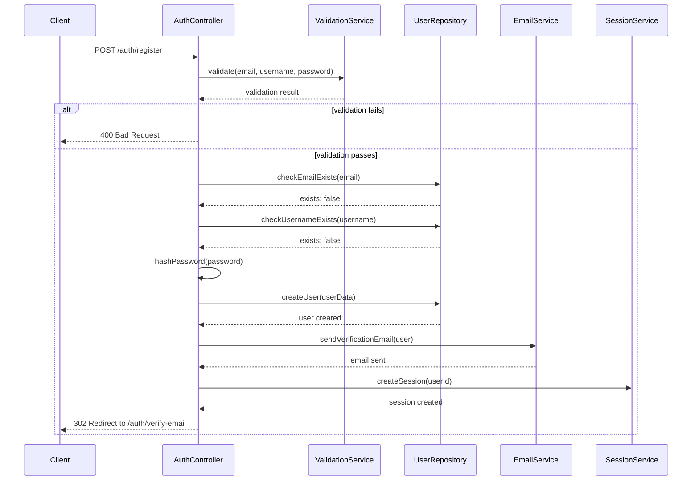

#### Subscription Creation Sequence
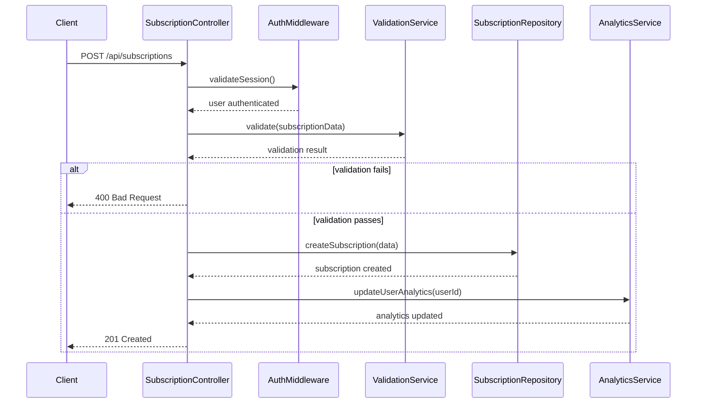

### Activity Diagrams

#### User Onboarding Process
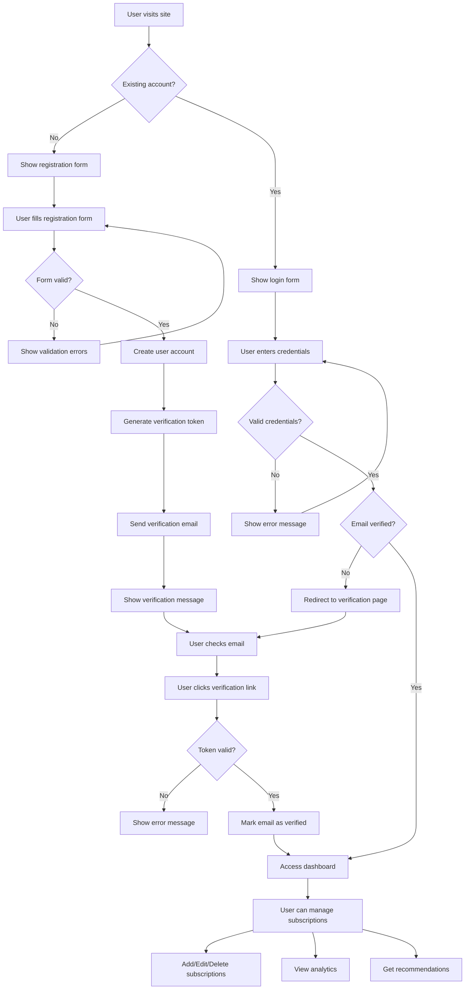

#### Subscription Management Workflow
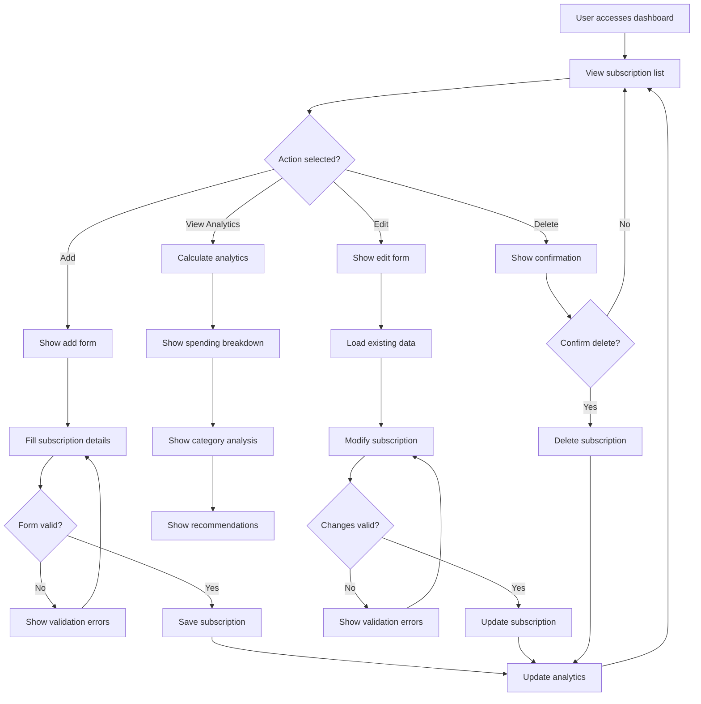

### State Diagrams

#### User Authentication States
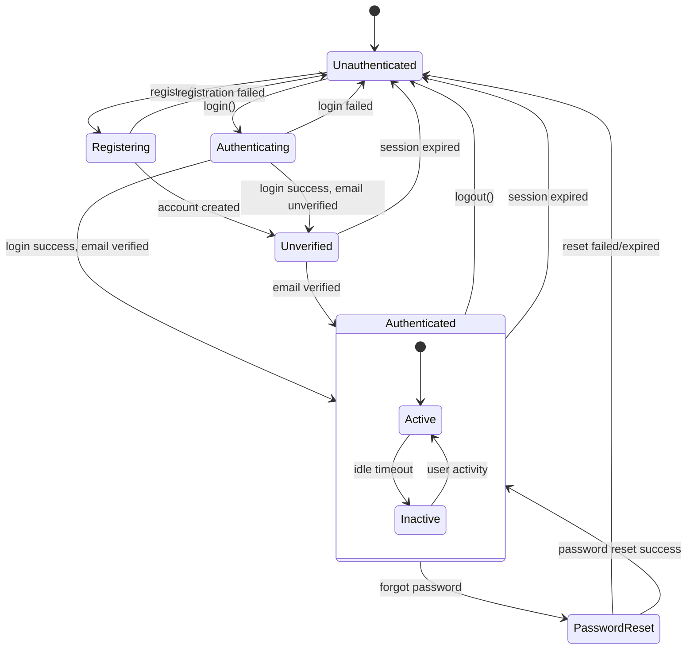

#### Subscription Lifecycle States
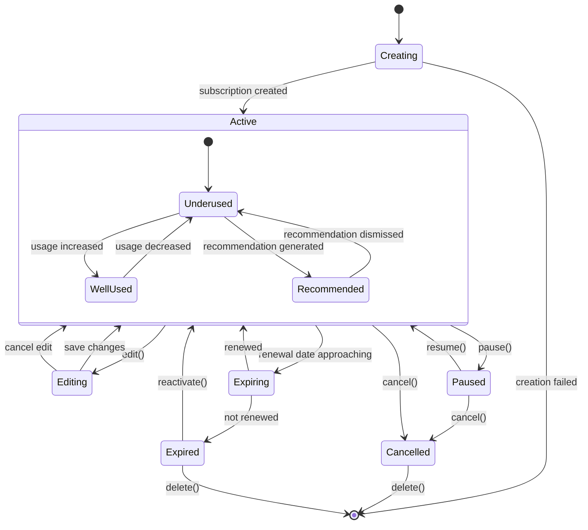

---

## Development Guide

### Enhanced Development Commands

#### Core Development Workflow
```bash
# Start development server with detailed logging
npm run dev

# Alternative: Run with specific port and host
npm run dev -- --port 3000 --host 0.0.0.0

# Build for production with optimization
npm run build

# Preview production build locally
npm run preview

# Run full development stack
npm run dev & npm run db:studio
```

#### Code Quality Automation
```bash
# Run all quality checks
npm run lint && npm run check && npm run format

# Auto-fix linting issues
npm run lint -- --fix

# Watch mode for type checking
npm run check:watch

# Format specific files
npx prettier --write src/routes/auth/

# Run ESLint on specific directory
npx eslint src/lib/server/
```

#### Testing Strategy
```bash
# Run all tests with coverage
npm run test

# Run unit tests in watch mode
npm run test:unit -- --watch

# Run specific test file
npm run test:unit -- auth.test.ts

# Run e2e tests with UI
npm run test:e2e -- --ui

# Run e2e tests in debug mode
npm run test:e2e -- --debug

# Generate test coverage report
npm run test:unit -- --coverage
```

#### Database Development
```bash
# Reset local database
rm local.db && npm run db:push

# Generate new migration
npm run db:generate

# Apply migrations to local database
npm run db:push

# Open database studio
npm run db:studio

# Check database schema
sqlite3 local.db ".schema"

# Apply migrations to D1 development
npm run db:d1:dev

# Apply migrations to D1 production (use with caution)
npm run db:d1:prod
```

### TypeScript Best Practices

#### Type Safety Guidelines
```typescript
// Use strict type definitions
interface User {
    id: string;
    email: string;
    username: string;
    emailVerified: boolean;
    createdAt: Date;
    updatedAt: Date;
}

// Use branded types for IDs
type UserId = string & { __brand: 'UserId' };
type SessionId = string & { __brand: 'SessionId' };

// Use discriminated unions for status
type SubscriptionStatus = 
    | { status: 'active'; renewalDate: Date }
    | { status: 'cancelled'; cancelledAt: Date }
    | { status: 'paused'; pausedAt: Date };

// Use proper error types
class ValidationError extends Error {
    constructor(
        public field: string,
        public code: string,
        message: string
    ) {
        super(message);
        this.name = 'ValidationError';
    }
}
```

#### SvelteKit Patterns
```typescript
// Page load functions with proper types
export const load: PageServerLoad = async ({ locals, url }) => {
    if (!locals.user) {
        throw redirect(302, '/auth/login');
    }
    
    return {
        user: locals.user,
        subscriptions: await getSubscriptions(locals.user.id)
    };
};

// Form actions with validation
export const actions: Actions = {
    create: async ({ request, locals }) => {
        if (!locals.user) {
            throw error(401, 'Unauthorized');
        }
        
        const formData = await request.formData();
        const subscription = await createSubscription(
            locals.user.id,
            formData
        );
        
        return { success: true, subscription };
    }
};
```

### Security Best Practices

#### Authentication Security
```typescript
// Password hashing configuration
const ARGON2_CONFIG = {
    memoryCost: 19456,
    timeCost: 2,
    outputLen: 32,
    parallelism: 1,
} as const;

// Session security
const SESSION_CONFIG = {
    name: 'auth-session',
    httpOnly: true,
    secure: process.env.NODE_ENV === 'production',
    sameSite: 'lax' as const,
    maxAge: 30 * 24 * 60 * 60, // 30 days
    path: '/',
} as const;

// Input validation
const validateEmail = (email: unknown): email is string => {
    return typeof email === 'string' && 
           email.length >= 3 && 
           email.length <= 320 && 
           /^[^\s@]+@[^\s@]+\.[^\s@]+$/.test(email);
};
```

#### Database Security
```typescript
// Use parameterized queries
const getUserByEmail = async (email: string) => {
    return await db
        .select()
        .from(table.user)
        .where(eq(table.user.email, email))
        .limit(1);
};

// Sanitize user input
const sanitizeSubscriptionName = (name: string) => {
    return name.trim().slice(0, 100);
};

// Validate foreign key relationships
const validateUserOwnsSubscription = async (
    userId: string, 
    subscriptionId: string
) => {
    const subscription = await db
        .select()
        .from(table.subscription)
        .where(
            and(
                eq(table.subscription.id, subscriptionId),
                eq(table.subscription.userId, userId)
            )
        )
        .limit(1);
    
    return subscription.length > 0;
};
```

### Performance Optimization

#### Database Optimization
```sql
-- Index for user authentication
CREATE INDEX idx_user_email ON user(email);
CREATE INDEX idx_user_username ON user(username);

-- Index for session management
CREATE INDEX idx_session_user_id ON session(user_id);
CREATE INDEX idx_session_expires_at ON session(expires_at);

-- Index for subscription queries
CREATE INDEX idx_subscription_user_id ON subscription(user_id);
CREATE INDEX idx_subscription_status ON subscription(status);
CREATE INDEX idx_subscription_category ON subscription(category);
```

#### Frontend Optimization
```typescript
// Lazy loading for large components
const Analytics = lazy(() => import('./Analytics.svelte'));

// Debounced search
import { debounce } from './utils/debounce';

const searchSubscriptions = debounce(async (query: string) => {
    const results = await fetch(`/api/subscriptions/search?q=${query}`);
    return results.json();
}, 300);

// Optimized list rendering
{#each paginatedSubscriptions as subscription (subscription.id)}
    <SubscriptionCard {subscription} />
{/each}
```

### Deployment Guidelines

#### Local Development Setup
```bash
# Install dependencies
npm install

# Set up environment variables
cp .env.example .env

# Initialize database
npm run db:push

# Start development server
npm run dev
```

#### Production Deployment
```bash
# Build application
npm run build

# Test production build
npm run preview

# Deploy to Cloudflare Pages
wrangler pages publish build

# Apply database migrations
npm run db:d1:prod
```

#### Environment Configuration
```env
# Development (.env)
NODE_ENV=development
DATABASE_URL=file:local.db
FROM_EMAIL=dev@example.com
RESEND_API_KEY=your_resend_key

# Production (Cloudflare Pages)
NODE_ENV=production
FROM_EMAIL=noreply@yourdomain.com
RESEND_API_KEY=your_production_key
```

### Monitoring and Debugging

#### Error Tracking
```typescript
// Centralized error handling
export const handleError = ({ error, event }) => {
    console.error('Application error:', error);
    
    // Don't expose sensitive errors to client
    if (error.code === 'DATABASE_ERROR') {
        return {
            message: 'An internal error occurred. Please try again.',
            code: 'INTERNAL_ERROR'
        };
    }
    
    return {
        message: error.message,
        code: error.code
    };
};

// Database query logging
const logQuery = (query: string, params: any[], duration: number) => {
    if (process.env.NODE_ENV === 'development') {
        console.log(`Query: ${query}`);
        console.log(`Params: ${JSON.stringify(params)}`);
        console.log(`Duration: ${duration}ms`);
    }
};
```

#### Performance Monitoring
```typescript
// Page load timing
export const load: PageServerLoad = async ({ locals }) => {
    const start = performance.now();
    
    const data = await getSubscriptions(locals.user.id);
    
    const duration = performance.now() - start;
    console.log(`Load time: ${duration}ms`);
    
    return { data };
};

// API response time tracking
export const GET: RequestHandler = async ({ url }) => {
    const start = Date.now();
    
    try {
        const result = await processRequest(url);
        return json(result);
    } finally {
        const duration = Date.now() - start;
        console.log(`API ${url.pathname}: ${duration}ms`);
    }
};
```

---

## Important Implementation Notes

### Current Development Status
- **Phase**: Authentication system implementation complete
- **Next Phase**: Subscription management system
- **Test Coverage**: Comprehensive e2e tests for authentication flows
- **Database**: Auth tables implemented, subscription tables planned

### Key File Locations
- **Authentication**: `src/lib/server/auth.ts`
- **Database Schema**: `src/lib/server/db/schema.ts`
- **API Routes**: `src/routes/auth/` and `src/routes/api/`
- **Components**: `src/lib/components/`
- **Tests**: `e2e/` (Playwright) and `src/**/*.test.ts` (Vitest)

### Development Priorities
1. **Mobile-First Design**: All components must work on mobile screens first
2. **Type Safety**: Use TypeScript strict mode throughout
3. **Security**: Follow security best practices for authentication and data handling
4. **Performance**: Optimize for mobile performance and fast loading
5. **Testing**: Maintain comprehensive test coverage for all features

### Code Standards
- Use TypeScript strict mode
- Follow SvelteKit conventions
- Implement proper error handling
- Use semantic HTML and accessibility features
- Follow mobile-first responsive design principles
- Maintain comprehensive test coverage

This comprehensive documentation serves as both a quick reference and detailed specification for all development work on the HateSub project.